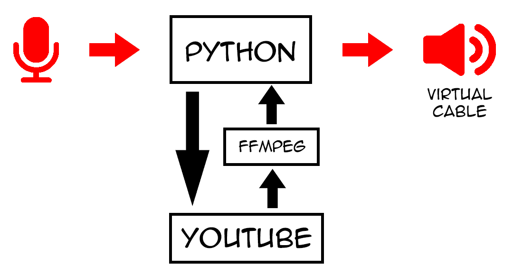
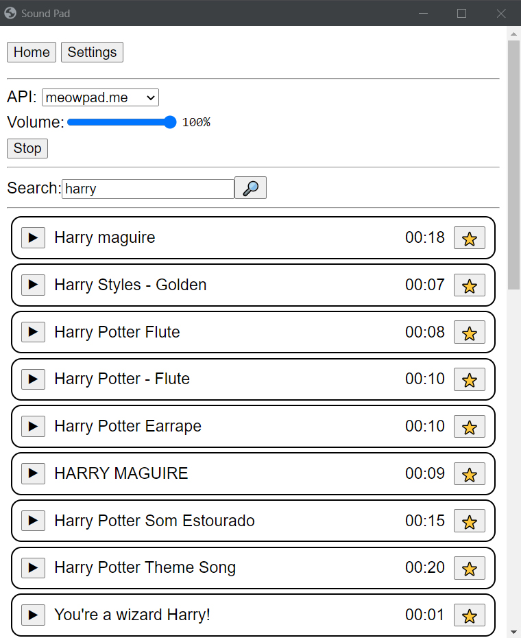
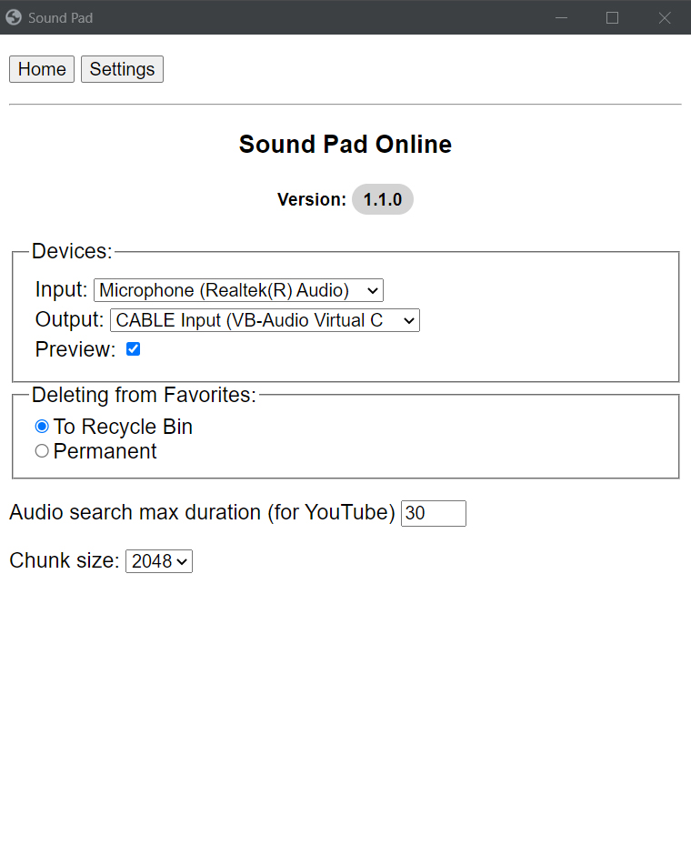
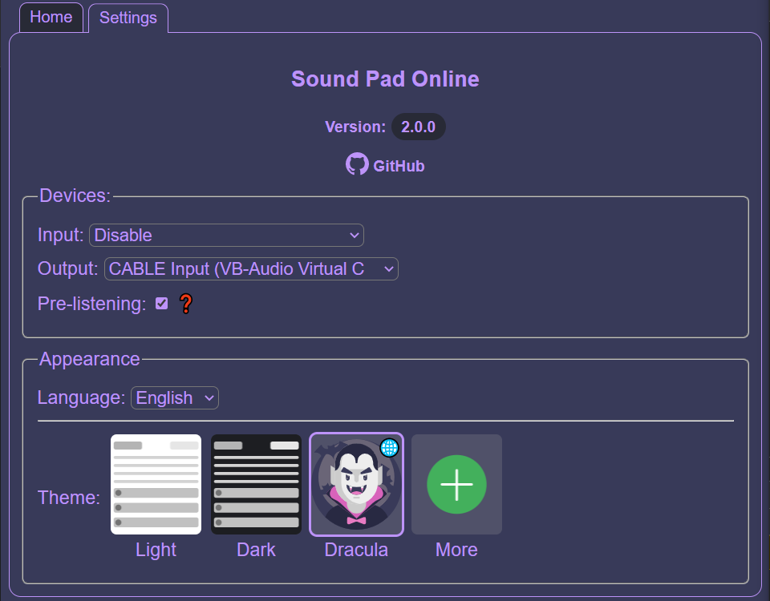

# Sound Pad Online

### Requirements:

1. [Ffmpeg](https://ffmpeg.org/)
2. [Virtual Audio Cable](https://vb-audio.com/Cable/)

### How it works:

  

### UI Example:

  
  

### Dracula theme already here

### Support project

You can help with:
* [Translations](github/translations.md)
* [Themes](github/themes.md)
* Make app icon
* Other (Programming)

#### 💲Or you can support financially💲:
(But now it's better to email me and I'll send you the details)
* [Donatello](https://donatello.to/super_zombi)
* [DonationAlerts](https://www.donationalerts.com/r/super_zombi)
