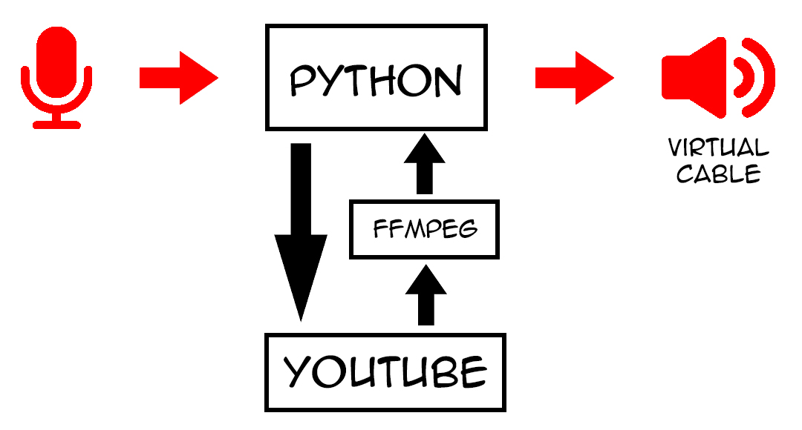
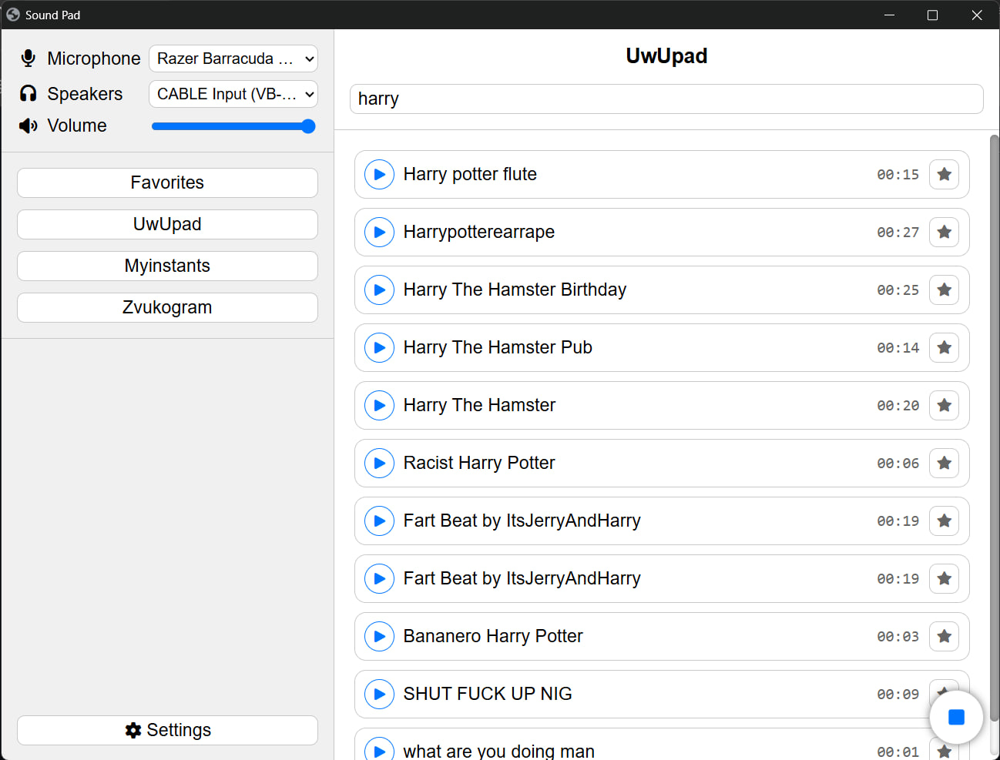
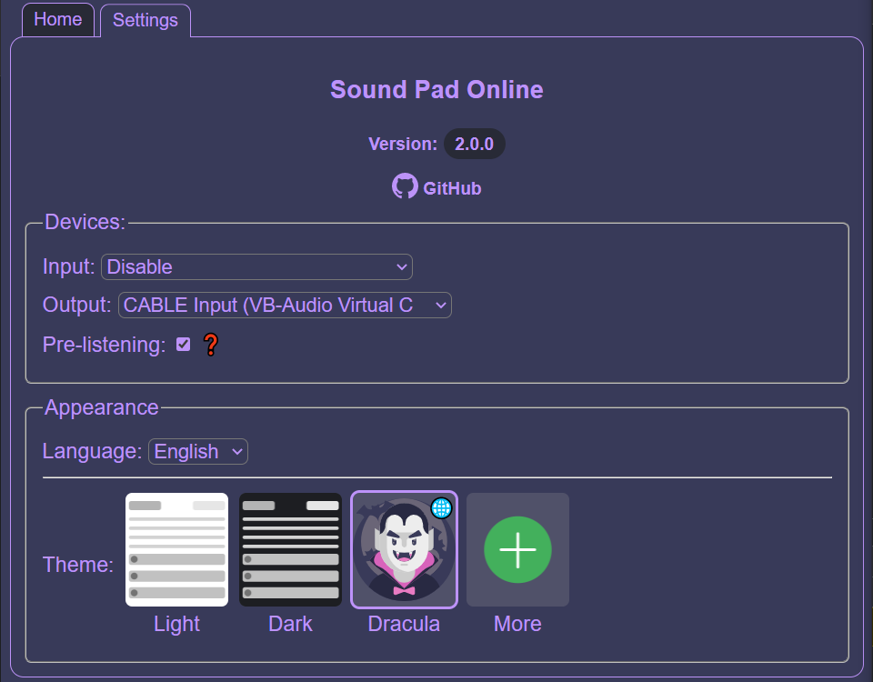
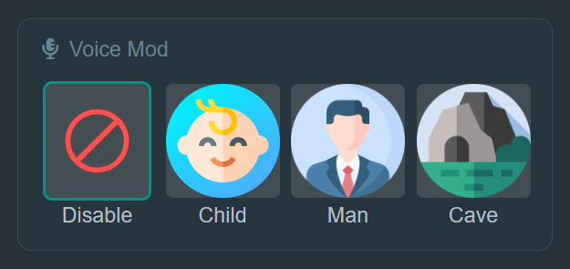

# Sound Pad Online

###  Download:

* [Sound-Pad.exe](https://github.com/SuperZombi/soundpad-online/releases/latest)

#### Required:
* [Virtual Audio Cable](https://vb-audio.com/Cable/)

### How it works:

  

  

### Custom themes

### Change your voice with VoiceMod

### Support project

You can help with:
* [Translations](github/translations.md)
* [Themes](github/themes.md)
* Make app icon
* Other (Programming)

#### 💲Or you can support financially💲:
<table>
  <tr>
    <td>
       
    </td>
    <td>
      <a href="https://donatello.to/super_zombi">Donatello</a>
    </td>
  </tr>
  <tr>
    <td>
       
    </td>
    <td>
      <a href="https://www.donationalerts.com/r/super_zombi">Donation Alerts</a>
    </td>
  </tr>
</table>
